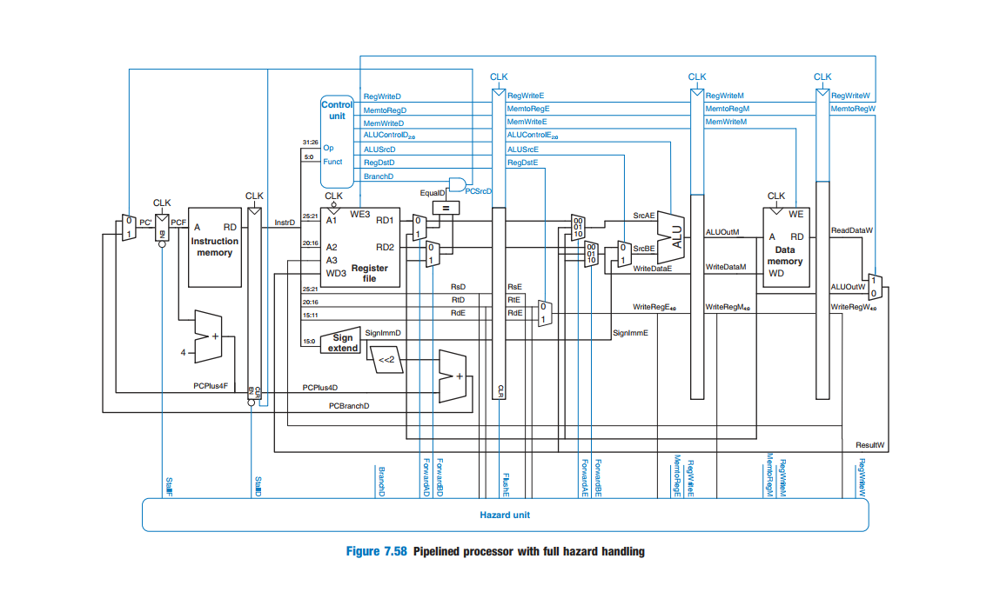
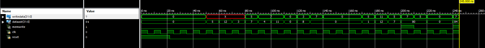

# Single Cycle Pipeline MIPS Processor

This project consists of a pipelined MIPS processor. The design implements branch prediction, forwarding and stalls hazard detection to improve the performance of a single-cycle processor. The design was composed using the textbook, "Digital Design and Computer Architecture" by David M. Harris and Sarah L. Harris. A processor's block diagram, Image 1, is shown below which details the datapath, modules used, and hazard detection unit. Waveform of the machine code being successfuly executed is shown in Image 2. 

 

   <b>Image 1: Block Diagram</b> 

   <b>Image 2: Output Waveform</b> 

